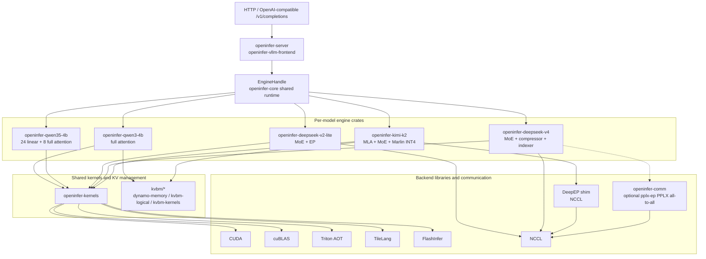

<p align="center">
  
</p>

<h1 align="center">openinfer</h1>

<p align="center">
  Pure Rust + CUDA LLM inference engine. No PyTorch. No model framework runtime.
</p>

<p align="center">
  <a href="#performance">Performance</a> &middot;
  <a href="#quickstart">Quickstart</a> &middot;
  <a href="#supported-models">Models</a> &middot;
  <a href="#api">API</a> &middot;
  <a href="#architecture">Architecture</a>
</p>

---

openinfer is a from-scratch LLM inference engine written in **~95K lines of Rust** and **~14K lines of CUDA**, plus Triton AOT kernels. No PyTorch, no ONNX, no model framework runtime — just Rust plus CUDA, Triton AOT, and generated compatibility kernels.

The goal is to understand every layer of the inference stack by building it from the ground up, and to explore what a Rust-native inference engine can look like.

## Performance

Head-to-head with **vLLM 0.22.1** on one **RTX 5090** (32 GB) — Qwen3-4B, BF16, TP1,
both engines measured by the same `vllm bench serve` client with identical seeds.

**On a prefix-cache hit — the multi-turn chat / agent hot path — openinfer returns
the first token up to 3× faster, and the lead grows with context:**

| Cached prompt | openinfer | vLLM 0.22.1 | speedup |
|--------------:|----------:|------------:|--------:|
| 1k tokens | 10.5 ms | 16.1 ms | 1.5× |
| 4k tokens | 14.5 ms | 27.3 ms | 1.9× |
| 8k tokens | 24.6 ms | 46.9 ms | 1.9× |
| 16k tokens | 30.3 ms | 90.8 ms | **3.0×** |

<sub>Warm TTFT, p50 of 20 samples per length. The tail behaves the same way:
openinfer's p99 stays within ~1 ms of its p50 at every length, while vLLM's reaches
100 ms at 16k. From 256 → 16k tokens, vLLM's warm TTFT grows ~7×; openinfer's grows ~3×.</sub>

Under serving load (Poisson arrivals, 1k-token prompts, 128-token outputs), openinfer
delivers lower TTFT at low load (50.7 vs 57.8 ms p50 at QPS 1, converging by QPS 8)
at identical output throughput, and cold prefill is at parity up to 16k context
(1.00 vs 1.11 s). vLLM is ahead on batched decode TPOT (7.36 vs 6.65 ms at QPS 1,
widening to 27% at QPS 8) and sustains ~12% more throughput past saturation —
openinfer's current ceiling is its largest CUDA-graph batch bucket (64 sequences),
which caps saturated decode at ~1.5k tok/s. Closing the batched-decode gap is active
work.

Full tables (p50/p99 at every QPS level, the saturation sweep, exact commands, and
caveats) are in
[`docs/benchmarks/qwen3-4b-serving-vllm-rtx5090.md`](docs/benchmarks/qwen3-4b-serving-vllm-rtx5090.md)
(measured 2026-06-10, openinfer `6901965`, vLLM 0.22.1 from PyPI). Qwen3.5-4B
single-stream latency is at parity with vLLM — see
[`docs/models/qwen35/optimization.md`](docs/models/qwen35/optimization.md).

## Quickstart

### Prerequisites

- Rust (2024 edition), CUDA Toolkit (nvcc, cuBLAS), CUDA-capable GPU
- NVIDIA driver R535 (CUDA 12.2) or newer; driver symbols resolve lazily at call time, so the `cuda-12090` cudarc feature does not raise the driver floor
- The default build (Qwen3-4B / 8B) is pure Rust + CUDA — no Python at all
- Python 3 + Triton for `qwen35-4b` feature builds (build-time only — no Python at runtime)
- TileLang for `deepseek-v4` feature builds (build-time only)
- `deepseek-v4` / `kimi-k2` EP paths additionally need NCCL ≥ 2.27 at runtime (`ncclAlltoAll`)

### Build & Run

```bash
# Download a model
huggingface-cli download Qwen/Qwen3-4B --local-dir models/Qwen3-4B

# Build & start server on port 8000 — no Python needed for the default Qwen3 build
export CUDA_HOME=/usr/local/cuda
cargo run --release
```

> **Note**: The server CLI is in `openinfer-server`. Model crates such as `openinfer-qwen3-4b`, `openinfer-qwen35-4b`, and `openinfer-deepseek-v4` contain model logic and diagnostics but are not server entrypoints. Use `cargo run --release` from the workspace root, or `cargo run --release -p openinfer-server -- --model-path <path>`.

```bash
# Try it
curl -s http://localhost:8000/v1/completions \
  -H "Content-Type: application/json" \
  -d '{"prompt": "The capital of France is", "max_tokens": 32}'

# Streaming
curl -N http://localhost:8000/v1/completions \
  -H "Content-Type: application/json" \
  -d '{"prompt": "Write a haiku about Rust:", "max_tokens": 64, "stream": true}'
```

> Always use `--release`. Debug builds are extremely slow for GPU/CUDA code.

<details>
<summary>More options</summary>

```bash
# Qwen3.5 requires the feature-gated Triton AOT kernels (Python + Triton at build time)
uv venv && uv pip install triton
export OPENINFER_TRITON_PYTHON=.venv/bin/python
cargo run --release --features qwen35-4b -- --model-path models/Qwen3.5-4B

# DeepSeek V4 Flash requires the feature-gated MP8 path and TileLang at build time
uv pip install "tilelang==0.1.9"
export OPENINFER_TILELANG_PYTHON=.venv/bin/python
cargo run --release --features deepseek-v4 -- --model-path models/DeepSeek-V4-Flash

# Disable CUDA Graph (useful for debugging)
cargo run --release -- --cuda-graph=false
```

**Environment variables:**

| Variable | Description |
|----------|-------------|
| `CUDA_HOME` | CUDA Toolkit path (default: `/usr/local/cuda`) |
| `OPENINFER_TRITON_PYTHON` | Python with Triton for `qwen35-4b` build-time AOT compilation |
| `OPENINFER_TILELANG_PYTHON` | Python with TileLang for `deepseek-v4` build-time kernel generation |
| `OPENINFER_CUDA_SM` | GPU SM target override when `nvidia-smi` unavailable (e.g. `120`) |

</details>

<details>
<summary>Windows</summary>

```powershell
$env:CUDA_PATH = "C:\Program Files\NVIDIA GPU Computing Toolkit\CUDA\v12.x"

# Default Qwen3 build needs no Python
cargo build --release
cargo run --release -p openinfer-server -- --model-path models/Qwen3-4B

# Qwen3.5 additionally needs Triton for the feature-gated AOT kernels
uv venv .venv --python 3.12
uv pip install "triton-windows<3.7"
$env:OPENINFER_TRITON_PYTHON = ".venv\Scripts\python.exe"
cargo run --release --features qwen35-4b -- --model-path models/Qwen3.5-4B
```

</details>

## Supported Models

| Model | Architecture | Params | Status |
|-------|-------------|--------|--------|
| [Qwen3-4B](https://huggingface.co/Qwen/Qwen3-4B) | Full attention (GQA) | 4B | Greedy + sampling, default feature, pure Rust + CUDA build |
| [Qwen3-8B](https://huggingface.co/Qwen/Qwen3-8B) | Full attention (GQA) | 8B | Greedy + sampling, default feature, pure Rust + CUDA build |
| [Qwen3.5-4B](https://huggingface.co/Qwen/Qwen3.5-4B) | Hybrid (24 linear + 8 full attention) | 4B | Greedy + sampling, feature-gated, `--features qwen35-4b` (build-time Triton) |
| [DeepSeek-V2-Lite](https://huggingface.co/deepseek-ai/DeepSeek-V2-Lite) | MoE + EP | 15.7B total / 2.4B active | Feature-gated, `--features deepseek-v2-lite`, 2-GPU path |
| [DeepSeek-V4-Flash](https://huggingface.co/deepseek-ai/DeepSeek-V4-Flash) | MoE + sparse attention, MP8 checkpoint | 671B total / 37B active | Initial greedy, feature-gated, 8-GPU MP8 |
| [Kimi-K2-Instruct](https://huggingface.co/moonshotai/Kimi-K2-Instruct) | MLA + MoE + Marlin INT4 | 1T total / 32B active | Feature-gated, `--features kimi-k2`, 8-GPU EP path |

Model type is auto-detected from `config.json` — just point `--model-path` at any supported model directory. Every model line is controlled by a cargo feature; only `qwen3-4b` is on by default, so the stock build serves Qwen3 with zero Python. Other lines require rebuilding `openinfer-server` with the matching `--features ...` flag before launch.

DeepSeek V4 support is intentionally narrower than the Qwen paths in the initial PR: it requires `--features deepseek-v4`, uses CUDA devices `0..7`, serves greedy requests only, terminates unsupported logprobs and non-greedy sampling requests with an explicit `stop_reason`, and does not use CUDA Graph yet.

## API

OpenAI-compatible `/v1/completions` endpoint.

| Field | Type | Default | Description |
|-------|------|---------|-------------|
| `prompt` | string | (required) | Input text |
| `max_tokens` | int | 128 | Maximum tokens to generate |
| `temperature` | float | 0.0 | Sampling temperature (0 = greedy) |
| `top_k` | int | 50 | Top-k sampling |
| `top_p` | float | 1.0 | Nucleus sampling threshold |
| `stream` | bool | false | Enable SSE streaming |

Sampling and logprob support is model-dependent. Qwen models support the sampling controls above; the initial DeepSeek V4 path accepts greedy requests only and reports unsupported parameters through `stop_reason`.

## Architecture



**Key design decisions:**

- **GPU-first runtime** — model execution stays in native Rust/CUDA paths; initial DeepSeek V4 still performs host-side greedy token selection from rank0 logits
- **Custom GPU kernels** — CUDA for decode-critical paths, Triton AOT for Qwen3.5 compatibility kernels, TileLang-generated CUDA for DeepSeek V4 compatibility kernels, FlashInfer for paged attention/sampling, NCCL for multi-GPU reductions, and cuBLAS for matrix multiplication
- **Fused operators where mature** — Qwen decode paths use fused attention/MLP kernels; DeepSeek V4 is currently a multi-stage MP8 path with TileLang kernels, NCCL reductions, and CUDA glue
- **BF16 storage, FP32 accumulation** — numerical stability without memory overhead
- **CUDA Graph** on Qwen decode paths — eliminates kernel launch overhead where enabled
- **Per-model crate boundary** — Qwen3-4B owns its config, weights, scheduler/executor, tests, benches, and kernel plan in `openinfer-qwen3-4b`

**Model details:**

- **Qwen3**: 32 Q heads, 8 KV heads (GQA 4:1), head_dim=128
- **Qwen3.5**: hybrid — 24 linear attention layers (Gated Delta Rule) + 8 full attention layers, head_dim=256
- **DeepSeek V4 Flash**: feature-gated 8-way MP8 checkpoint with MoE routing, sparse attention, FP8/FP4 TileLang kernels, and OpenAI-compatible greedy serving

### What's not (yet) implemented

- Additional quantization modes such as INT8/INT4

## Development

### Tests

```bash
# Unit tests
cargo test --release --workspace --lib

# Accuracy and integration tests (need GPU + model weights)
OPENINFER_TEST_MODEL_PATH=models/Qwen3-4B cargo test --release -p openinfer-qwen3-4b --test hf_golden_gate
OPENINFER_TEST_MODEL_PATH=models/Qwen3.5-4B cargo test --release -p openinfer-qwen35-4b --features qwen35-4b --test hf_golden_gate
OPENINFER_TEST_MODEL_PATH=models/Qwen3.5-4B cargo test --release -p openinfer-qwen35-4b --features qwen35-4b --test e2e_scheduler
OPENINFER_TEST_MODEL_PATH=models/DeepSeek-V4-Flash cargo test --release -p openinfer-deepseek-v4 --features deepseek-v4 --test e2e
```

### Triton AOT

Triton compiles the Qwen3.5 GDR chunkwise prefill kernels at build time, gated behind the `qwen35-4b` feature — the default Qwen3 build never invokes Python. Qwen3-4B dense full-attention kernels are CUDA/cuBLAS/FlashInfer C++ wrappers. Runtime has no Python dependency — Triton is build-time only.

See `openinfer-kernels/tools/triton/README.md` for setup and troubleshooting.

### Source Layout

<details>
<summary>Expand</summary>

```
Cargo.toml                         # Virtual workspace root

openinfer-server/                  # Product package: CLI, vLLM frontend, benchmarks
├── src/main.rs                    # CLI + vLLM/OpenAI server startup
├── src/vllm_frontend.rs           # vLLM engine-core bridge into a generic EngineHandle
├── src/server_engine.rs           # Model detection and shared server helpers
├── src/scheduler.rs               # Compatibility re-export of core engine request/event types
├── src/ops.rs                     # Compatibility re-export of shared GPU ops
├── src/ops/tests.rs               # Server package operator coverage tests
├── src/tensor.rs                  # Re-export of openinfer-kernels tensor types
├── src/sampler.rs                 # Temperature, top-k, top-p sampling
└── src/logging.rs                 # Runtime logging setup

openinfer-core/                    # Shared runtime API for model crates
├── src/engine.rs                  # EngineHandle, GenerateRequest, TokenEvent
├── src/kv_pool.rs                 # Paged KV pool and request state
├── src/ops.rs                     # Shared op wrappers over openinfer-kernels
└── src/weight_loader.rs           # Safetensors helpers shared by model crates

openinfer-kernels/                 # Shared GPU kernel/runtime crate
├── KERNELS.md                     # LLM routing index for model op -> wrapper -> FFI -> source
├── src/                           # GPU tensor types, FFI, paged KV layout, Rust ops
├── csrc/                          # Hand-written CUDA / FlashInfer C++ wrappers
└── tools/triton/                  # Triton AOT kernels (build-time compiled)

openinfer-qwen3-4b/                # Qwen3-4B model-owned engine crate
├── src/                           # Config, weights, prefill/decode/unified, scheduler/executor
├── tests/                         # Qwen3 HF logits gate and integration coverage
├── benches/                       # Qwen3 model-level benchmarks
└── src/kernel_plan.rs             # Model DAG phase -> kernel routing index

openinfer-qwen35-4b/               # Qwen3.5-4B model-owned engine crate
├── src/                           # Config, weights, prefill/decode/unified, recurrent state, scheduler
├── tests/                         # Qwen3.5 HF logits gate and scheduler integration
└── benches/                       # Qwen3.5 recurrent/norm operator benchmarks
```

</details>

## License

Apache-2.0 — see [LICENSE](LICENSE) and [NOTICE](NOTICE). Components ported from
NVIDIA Dynamo (the `kvbm/` crates) retain their original Apache-2.0 headers; see
[NOTICE_DYNAMO](NOTICE_DYNAMO).
